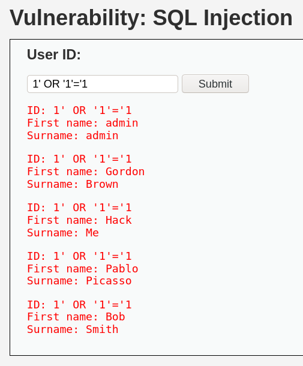
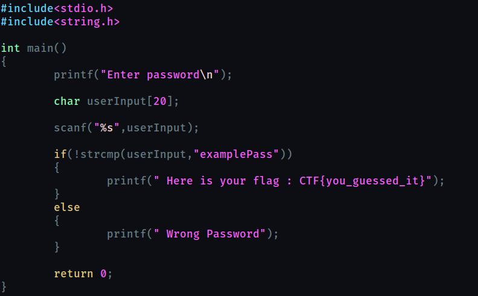
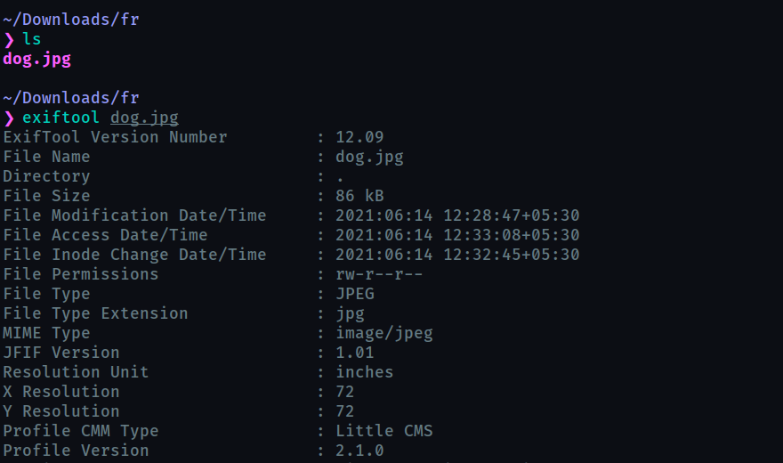

# Intro to CTFs

#### + other things you should know

---

## CTF

* Capture The Flag
* Special kind of information security competitions
* Use [ctftime.org](https://ctftime.org) to track CTFs and your team’s performance

----

### Flag

* A secret string
* Can be found only when you successfully solve the challenge
* Thus, submitted as a proof of completion
* Usually of a format like `xyzCTF{}`
* In pentesting and some CTF variants, the flag can be found in a file
* Accessible only when you break in and gain access

----

### ctftime.org

* CTF calendar
* World-wide and country-wide team ratings
* Writeups

---

## Variants

* Jeopardy
* Attack-Defence
* KOTH
* Hardware

----

### Jeopardy

* Challenges from various categories
* Most famous
* Find the flag and submit it for points
* Sometimes, dynamic scoring -> more solves, less points
* Extra points for the first solve - `First Blood`

----

### Attack-Defence

* Each team will be given a vulnerable service
* Teams will defend their own service and patch it up
* Simultaneously, attack the other teams' services and develop exploits
* DEFCON and NYU-CSAW Finals

----

### KOTH

* King Of The Hill
* Asbolute chaos and fun
* Multiple teams
* Single target network consisting of many inter-connected systems
* Repeatedly pivot and gain access to systems
* Defend them from other teams
* TryHackMe and HackTheBox

----

### Hardware

* Black box testing
* Break built-in security measures
* Example: side-channel attacks

---

## Categories

* Cryptography
* Web Exploitation
* Reverse Engineering
	* Binary Exploitation
* Forensics
	* Steganography
* OSINT
* Programming

---

### Cryptography

* Cryptic message with a hint in the challenge description or title
* Deeper concepts require a good knowledge of mathematics
* Rotation ciphers are a starting point

----

### ROTN

* Encryption by shifting each character by N places to the right
* Most popular - **ROT13** aka Caesar Cipher

$$E_n(x) = (x+n) mod 26$$

$$E_n^\prime(x) = D_n(x) = (x-n) mod 26$$

----

### Challenge #4

**Encrypted message:** (HEX)

`170d05080a0d0c0a19010a06041e06020a19`

**Encryption Key:** (HEX)

`6468696e6368616b706f6f6a61726f636b73`

**Encryption Method:**

`XOR`

Decrypt the message

----

### Solution

**Property of XOR:**

1. $$a \oplus a = 0$$

2. $$a \oplus 0 = a$$

----

$$\implies msg \oplus key \oplus key = msg$$

XOR the encrypted message with the key again to get the original message again

`73656c6669656d61696e656c656c6961616a`

---

### Web Exploitation

* Deals with web applications
* Identify flaws in the working of the web app
	* how it processes user input
	* programming flaw
* Knowledge of web development will be helpful
	* at least, you require the ability to read and understand JS and PHP code
* [OWASP Top10](https://owasp.org/www-project-top-ten/)

----

### Challenge #1

* Text box that receives input of ID of person
* Outputs all the details of that person
* Incomplete or invalid queries err out silently


----

### HINT 1

SQL query in the backend might be something similar to

```SQL
SELECT * FROM accounts WHERE id="$INPUT_ID";
```

----

### HINT 2

Think about logical operators

----

### HINT 2

**$INPUT_ID**:

```
1" OR <SOME_CONDITION>
```

**Complete query**:

```SQL
SELECT * FROM accounts WHERE id="1" OR <SOME_CONDITION>";
```

----

### HINT 3

Think about a condition which is always true

----

### HINT 3

**$INPUT_ID**:

```
1" OR 1=1
```

**Complete query**:

```SQL
SELECT * FROM accounts WHERE id="1" OR 1=1";
```

**But**, is this query valid?

----

### HINT 4

How do we make this query valid?

Find the connect

* `//` in C++
* `#` in Python

----

### HINT 4

The SQL query can be terminated by introducing comment characters in the input

**$INPUT_ID**:

```
1" OR 1=1#
```

**Complete query**:

```SQL
SELECT * FROM accounts WHERE id="1" OR 1=1#";
```

----

### Solution

**Final query**:

```SQL
SELECT * FROM account WHERE id="1" OR 1=1#";
```

interpreted as

```SQL
SELECT * FROM account WHERE id="1" OR 1=1;
```

----



---

### Reverse Engineering

- In simple terms Reverse Engineering refers to the process of deconstructing any engineered object to figure out the internal mechanisms.

- Reverse Engineering in a CTF is typically the process of taking a compiled program ( like apk, exe, elf ) and converting it back into a more human readable format.

- The goal of a reverse engineering challenge is to understand the functionality of a given program such that you can identify deeper issues.

----


----

## Example



----


----


----


----


----


---

### Forensics

- Forensics is the art of recovering the digital trail left on a computer. There are plently of methods to find data which is seemingly deleted, not stored, or worse, covertly recorded.

- In a CTF context, "Forensics" challenges can include file format analysis, steganography, memory dump analysis, or network packet capture analysis.

----

- Any challenge to examine and process a hidden piece of information out of static data files (as opposed to executable programs or remote servers) could be considered a Forensics challenge

----

### Example

We are given an image, and it might contain certain hidden information


----

We start by examining the file type and other metadata of the image using the tool `exiftool`



`exiftool` didn't tell us anything usefull except that it is infact a `jpeg` image

----

Now we will use `binwalk` tool to examine if there is some compressed data inside the image


looks like there is a `hidden_text.txt`file  compressed in the image. We can extract it using `binwalk -e` command.

----


Finally we got the "flag".

---

### OSINT

* Open Source INTelligence
	* Anything that is available to everybody in the internet
* If you know how to search smartly, the challenge is already over
* Google Dorks is your excalibur

----

### Challenge #5

* Find my roll number

----

### Solution

**Google query**:

```
<name> <roll_num_format> site:<college website>
```

---

### Programming

* Programming challenge
* Usually automation related or simple problem-solving
* **Python** is high-level general purpose programming language
	* Huge library and community
* Used in all places, right from RE to WE

----

### Challenge #6

* You are given a large chunk of text worth easily over 100MB

```
akOjas;kdfjFs;kdfjasFkfja;kfajf;kIjfdkjCfkafEk
weruqwIeuqworieuSwoeruqperuqpweruqTeriuqwpHerw
zmnEcv,mncv,mznvzvnzvBvnzvnzmvnzmcvnzExvbzcvbs
qwemSnq,embrtjThvovchzoivucTaanfamfdnqVewnrucp
ewnSqmnrzhvcHicvuapiuasdfna.OenrqwmenrjhWziocu
```

----

## HINT

* Anything odd?

```
akOjas;kdfjFs;kdfjasFkfja;kfajf;kIjfdkjCfkafEk
weruqwIeuqworieuSwoeruqperuqpweruqTeriuqwpHerw
zmnEcv,mncv,mznvzvnzvBvnzvnzmvnzmcvnzExvbzcvbs
qwemSnq,embrtjThvovchzoivucTaanfamfdnqVewnrucp
ewnSqmnrzhvcHicvuapiuasdfna.OenrqwmenrjhWziocu
```

----

### Solution

* Notice that the capital letters form something meaningful
* Some ezpz programming with ASCII values
* Extracted capital letter form this:

```
OFFICEISTHEBESTTVSHOW
```

---

### Pentesting

* Penetration testing
* "Penetrate" the security measures and gain access to the system
* Multiple ways to exploit a single system
* Usually involves one or more of the above categories
* Simulates real world scenarios

---

## Practice sites

* [TryHackMe](https://tryhackme.com)
* [VulnHub](https://www.vulnhub.com/)
* [HackTheBox](https://hackthebox.eu)

---

**Don't be a script kiddie**


---

## Writeups and reports

* Make sure to record your approaches
* Preferably in markdown, because
	* Plain text -> easily transferrable
	* Exportable to literally any other format
	* No need to install another application
	* Your favourite text editor will do

----

* Will definitely benefit you in long pentests where you will connect multiple services and systems to develop an exploit
* Professional pentesters are expected to provide 30-page reports
* [OffSec report](https://www.offensive-security.com/reports/sample-penetration-testing-report.pdf)
* Helpful to others too

---

## Blog

If you dislike any or all of the following

* front-end web development
* writing HTML code and content
* styling with CSS
* creating your webpage from scratch

then, [**Jekyll**](https://github.com/topics/jekyll-theme) is your friend

----

* Write content in markdown and Jekyll will generate the HTML for it
* **GitHub pages** offers free and easy hosting solution for static websites
* Check out `jekyll-themes` on GitHub for amazing repos and sites

---

## More about OWASP

* [OWASP](https://owasp.org) is a non-profit org
* Aims to make security more accessible
* [Local chapters](https://owasp.org/chapters/) work in this spirit
* Chapters have comm channels and regular events
* Stay tuned for more exciting events from [our chapter](https://owasp.org/www-chapter-indian-institute-of-technology-patna/)
